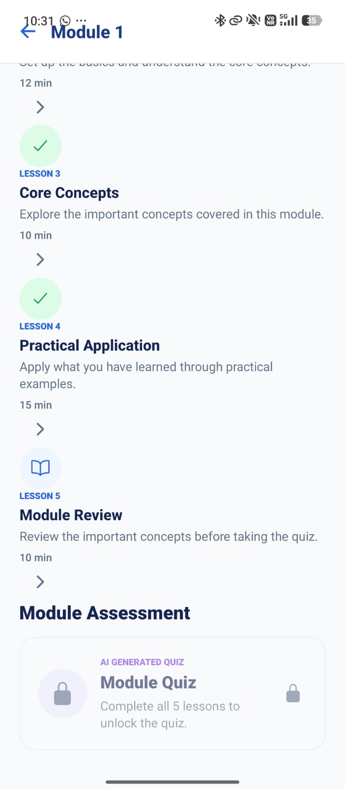
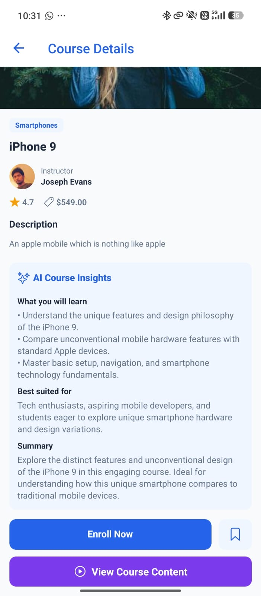
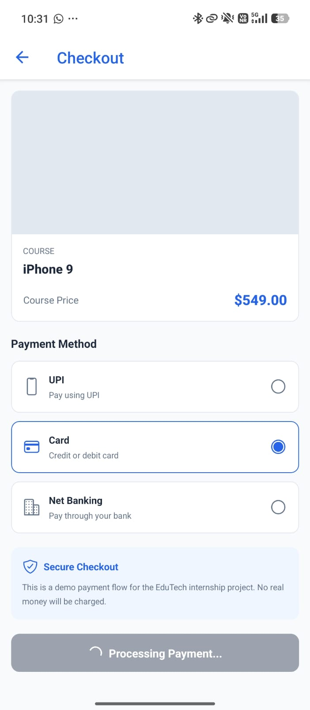
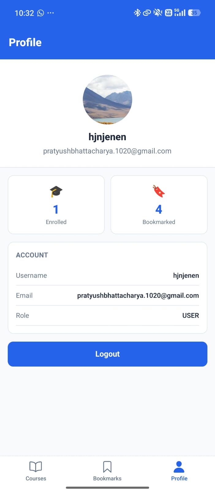

# EduTech LMS -- React Native Internship Task

A React Native + Expo Learning Management System enhanced as part of the
React Native Internship Task.

The application provides course discovery, authentication, bookmarking,
enrollment, demo checkout, structured learning modules, lesson
progression, progress tracking, and an AI-powered quiz system.

------------------------------------------------------------------------

## 📱 Project Overview

  Item                   Details
  ---------------------- --------------------------------------------
  **Project**            EduTech LMS
  **Platform**           React Native + Expo
  **Primary Testing**    Android
  **Backend**            FreeAPI-based REST API deployed on Railway
  **Database**           MongoDB Atlas
  **AI**                 Google Gemini API
  **Navigation**         Expo Router
  **State Management**   React Context / Zustand-based stores
  **Styling**            NativeWind + React Native StyleSheet

------------------------------------------------------------------------

## ✨ Features

### Authentication

-   User registration and login
-   Logout
-   Persistent authentication
-   Secure token storage on native devices
-   Registration and login validation

### Course Discovery

-   Course listing and search
-   Course details
-   Instructor information
-   Ratings and pricing
-   Course thumbnails
-   Bookmark/unbookmark courses

### Enrollment & Checkout

-   Course enrollment
-   Demo checkout flow
-   UPI, Card, and Net Banking options
-   Payment processing state
-   Enrollment confirmation
-   Start Learning flow

> **Note:** This is a demo payment flow. No real money is charged.

### Learning Hub

-   Course-specific Learning Hub
-   Module-based learning
-   Lesson progression
-   Module progression
-   Course and module progress tracking
-   Locked/unlocked lessons and modules
-   Lesson completion tracking

### AI-Powered Learning

-   AI-generated quizzes
-   Questions generated from learning content
-   Multiple-choice questions
-   Score calculation
-   90% passing requirement
-   Quiz retry flow
-   Next-module unlocking after successful quiz completion
-   Gemini model fallback handling

### Profile

-   User profile
-   Enrolled course count
-   Bookmark count
-   Account information
-   Logout

------------------------------------------------------------------------

# 🧪 Application Testing

Testing was performed on Android using Expo Go during development and
the standalone EAS Preview APK for final verification.

## 📱 Application Screenshots

The following screenshots demonstrate the main application flows and features tested on a physical Android device.

### 🔐 Authentication

| Login |
|---|
|  |

### 📚 Course & Learning Flow

| Course Page | Course Modules |
|---|---|
|  |  |

| Start Learning | Lessons |
|---|---|
|  |  |

| Lesson Completed |
|---|
|  |

### 💳 Enrollment & Payment

| Enrollment | Payment |
|---|---|
|  |  |

| Successful Payment |
|---|
|  |

### 👤 User Profile

| Profile |
|---|
|  |

### Authentication

-   Registration with valid details
-   Registration validation
-   Valid login
-   Invalid/non-existing credentials
-   Logout
-   Login after logout
-   App restart with an authenticated session

### Courses

-   Course listing
-   Course search
-   Course details
-   Instructor information
-   Bookmarking/unbookmarking
-   Course enrollment

### Checkout

-   Opening checkout
-   UPI selection
-   Card selection
-   Net Banking selection
-   Payment processing
-   Successful enrollment
-   Starting learning after enrollment

### Learning Flow

-   Learning Hub
-   Modules
-   Lessons
-   Lesson completion
-   Lesson locking
-   Module locking
-   Course progress
-   Module progress

### AI Quiz

-   AI quiz generation
-   Answering questions
-   Score calculation
-   Failed attempt
-   Retry
-   Successful attempt
-   Next-module unlocking

### Edge Cases

-   Invalid login credentials
-   Locked lessons
-   Locked modules
-   Quiz score below passing threshold
-   Temporary Gemini model availability issues
-   API request timeout handling
-   Restarting the app while authenticated

------------------------------------------------------------------------

# 🔎 Limitations, Bugs & Findings

## 1. AI Model Availability

**Finding:** AI generation depends on external Gemini model
availability. During testing, some Gemini models temporarily returned
high-demand/503 responses.

**Solution:** Implement model fallback logic so that if one Gemini model
is unavailable, the application automatically attempts another supported
model.

**Status:** **Resolved.**

## 2. Mobile Learning Card Layout

**Finding:** On Android, some Learning Hub and Module cards can require
additional UI polishing to keep lesson/module text and trailing controls
consistently aligned across screen sizes.

**Solution:** Use explicit flex constraints such as `flexShrink`,
fixed-width trailing action containers, and platform-specific layout
adjustments.

**Status:** Identified and documented. Further UI polishing was
intentionally left outside the final submission scope.

## 3. Duplicate Learning Hub Header on Android

**Finding:** The Learning Hub can display both the Expo Router native
header and a custom Learning Hub header on Android.

**Solution:** Use platform-specific navigation header configuration or
disable the native header for this route when the custom header is
displayed.

**Status:** Identified and documented. Further UI polishing was
intentionally left outside the final submission scope.

## 4. External API Dependency

**Finding:** Course and instructor information depends on the deployed
backend/API being reachable.

**Solution:** Use request timeouts, clear error states, retry actions,
and offline indicators.

**Status:** Implemented/handled through the application's API timeout
and network-status handling.

## 5. Development-Time Expo Warnings

**Finding:** Some development-only warnings can appear during Expo
development.

**Solution:** Track these warnings during future maintenance and update
affected dependencies/components when stable replacements are available.

**Status:** Documented as non-blocking development issues.

------------------------------------------------------------------------

# 🐛 Resolved Bug / Limitation

## AI Quiz Reliability and Flow

The AI quiz flow could fail when a single configured Gemini model was
temporarily unavailable.

A fallback-based generation flow was implemented so the application
attempts configured Gemini models sequentially instead of depending on
only one model.

### Result

The quiz flow was tested with:

-   Successful quiz generation
-   Quiz answering
-   Score calculation
-   Failed attempts
-   Retry
-   Passing attempts
-   Module unlocking

------------------------------------------------------------------------

# 🚀 Unique Feature

## AI-Powered Learning Quiz

The Learning Hub was extended with an AI-powered quiz system that
converts course/lesson learning content into an interactive assessment.

### How It Works

1.  The student completes the required lessons in a module.
2.  The AI quiz becomes available.
3.  Google Gemini generates multiple-choice questions.
4.  The student answers the questions.
5.  The application calculates the score.
6.  A minimum score of **90%** is required to pass.
7.  A failed attempt can be retried.
8.  Passing the quiz unlocks the next module.

### Learning Loop

``` text
Learn Lessons
     ↓
Complete Module Lessons
     ↓
AI Generated Quiz
     ↓
Evaluate Understanding
     ↓
Pass / Retry
     ↓
Unlock Next Module
```

------------------------------------------------------------------------

# 📚 Learning Progress Structure

Each course contains:

-   5 modules
-   5 normal lessons per module
-   1 AI quiz per module

Therefore:

``` text
5 Modules × 5 Lessons = 25 Lessons
```

The AI quiz acts as the assessment gate for each module.

### Unlocking Rules

``` text
Module 1
   ↓
Complete all 5 lessons
   ↓
Take AI Quiz
   ↓
Score ≥ 90%
   ↓
Module 2 unlocked
```

The same process continues for the remaining modules.

------------------------------------------------------------------------

# 📊 Progress Tracking

### Course Progress

Course progress is calculated from completed lessons across the course.

Example:

``` text
1 / 25 lessons completed
= 4% course progress
```

### Module Progress

Module progress is calculated from the five normal lessons in that
module.

Example:

``` text
1 / 5 lessons completed
= 20% module progress
```

### Quiz Progression

AI quizzes act as module completion gates and determine whether the next
module can be accessed.

------------------------------------------------------------------------

# 🛠️ Technical Architecture

``` text
                    EduTech LMS
                         │
                         ▼
                React Native + Expo
                         │
              ┌──────────┴──────────┐
              ▼                     ▼
         Expo Router          App State
              │                     │
              ▼                     ▼
      Application Screens     Learning Store
              │
              ▼
         REST API Layer
              │
              ▼
       Railway Backend
              │
              ▼
         MongoDB Atlas
              │
              ├───────────────┐
              ▼               ▼
       Course/User APIs   Gemini AI API
```

------------------------------------------------------------------------

# 🌐 Backend Deployment

**Backend:** Railway\
**Database:** MongoDB Atlas

The Expo application uses:

``` env
EXPO_PUBLIC_BASE_URL=https://freeapi-app-mongodburi.up.railway.app
```

The mobile application communicates with the deployed backend and does
**not** connect directly to MongoDB.

------------------------------------------------------------------------

# 🔐 Environment Variables

Create a `.env` file in the project root:

``` env
EXPO_PUBLIC_BASE_URL=https://freeapi-app-mongodburi.up.railway.app
EXPO_PUBLIC_GEMINI_API_KEY=YOUR_GEMINI_API_KEY
```

### Security

-   Do not commit `.env` files or API keys to GitHub.
-   The repository `.gitignore` excludes environment files.
-   Never put MongoDB credentials in the Expo application's `.env`.
-   Database credentials remain on the backend.
-   `EXPO_PUBLIC_*` values are client-side configuration and should not
    be treated as server-side secrets.

------------------------------------------------------------------------

# 💻 Local Setup

## 1. Clone

``` bash
git clone https://github.com/nayan777pratyush/edutech-lms-intern-task.git
cd edutech-lms-intern-task
```

## 2. Install dependencies

``` bash
npm install
```

## 3. Configure `.env`

``` env
EXPO_PUBLIC_BASE_URL=https://freeapi-app-mongodburi.up.railway.app
EXPO_PUBLIC_GEMINI_API_KEY=YOUR_GEMINI_API_KEY
```

## 4. Start Expo

``` bash
npx expo start
```

For a clean Metro cache:

``` bash
npx expo start --clear
```

------------------------------------------------------------------------

# 📱 Android Testing with Expo Go

Install **Expo Go** on an Android device.

Run:

``` bash
npx expo start
```

Scan the QR code using Expo Go.

------------------------------------------------------------------------

# 📦 Android Preview APK

The project uses an EAS Preview profile that generates an Android APK.

Build command:

``` bash
eas build --platform android --profile preview
```

The final standalone APK was successfully built with EAS and
independently tested on an Android device.

Verified on the standalone APK:

-   Registration
-   Login
-   Backend connectivity
-   Course loading
-   Learning flow
-   AI quiz generation

The final APK is provided through the GitHub Release.

------------------------------------------------------------------------

# 🧪 Recommended Evaluation Flow

``` text
Register
   ↓
Login
   ↓
Browse Courses
   ↓
Open Course
   ↓
Enroll
   ↓
Checkout
   ↓
Start Learning
   ↓
Open Module 1
   ↓
Complete Lessons
   ↓
Generate AI Quiz
   ↓
Attempt Quiz
   ↓
Pass with ≥ 90%
   ↓
Module 2 Unlocks
```

------------------------------------------------------------------------

# 🧰 Main Technologies

-   React Native
-   Expo
-   Expo Router
-   TypeScript
-   NativeWind
-   React Native WebView
-   Expo Secure Store
-   AsyncStorage
-   Google Gemini API
-   REST APIs
-   Railway
-   MongoDB Atlas
-   EAS Build

------------------------------------------------------------------------

# 📁 Important Project Structure

``` text
edutech-lms-intern-task/
│
├── app/
│   ├── (auth)/
│   ├── (tabs)/
│   ├── course/
│   ├── learning/
│   │   ├── [id].tsx
│   │   ├── module/
│   │   ├── lesson/
│   │   └── quiz/
│   ├── payment/
│   └── webview.tsx
│
├── components/
├── constants/
├── hooks/
├── providers/
├── store/
├── utils/
├── assets/
├── .gitignore
├── app.json
├── eas.json
├── package.json
└── README.md
```

------------------------------------------------------------------------

# 🔒 Security Notes

-   Environment files are excluded from Git.
-   API keys are supplied through environment configuration.
-   Database credentials remain on the backend.
-   The mobile application communicates with the deployed backend rather
    than directly accessing MongoDB.
-   No MongoDB credentials are included in the Expo application.
-   Never commit real API keys or database connection strings to the
    repository.

------------------------------------------------------------------------

# ✅ Submission Checklist

-   [x] Existing application explored
-   [x] Android testing completed
-   [x] Authentication tested
-   [x] Course flow tested
-   [x] Enrollment flow tested
-   [x] Checkout flow tested
-   [x] Learning Hub implemented
-   [x] Lesson progression implemented
-   [x] Module locking implemented
-   [x] AI quiz implemented
-   [x] Quiz retry implemented
-   [x] Progress tracking implemented
-   [x] Limitations and bugs documented
-   [x] Feasible solutions documented
-   [x] AI quiz reliability limitation resolved
-   [x] Unique feature added
-   [x] Backend deployed
-   [x] MongoDB connected
-   [x] Source code pushed to GitHub
-   [x] Final README prepared
-   [x] Android Preview APK generated
-   [x] APK tested independently on Android
-   [x] Corrected APK ready for release

------------------------------------------------------------------------

# 👨‍💻 Repository

GitHub repository:

https://github.com/nayan777pratyush/edutech-lms-intern-task

------------------------------------------------------------------------

## Internship Task

This project was completed as part of the React Native Internship Task.

The implementation focuses on understanding the existing application,
testing real user flows, identifying practical limitations, resolving an
application issue, adding a meaningful AI-powered feature, documenting
the work, and preparing a testable Android build.
